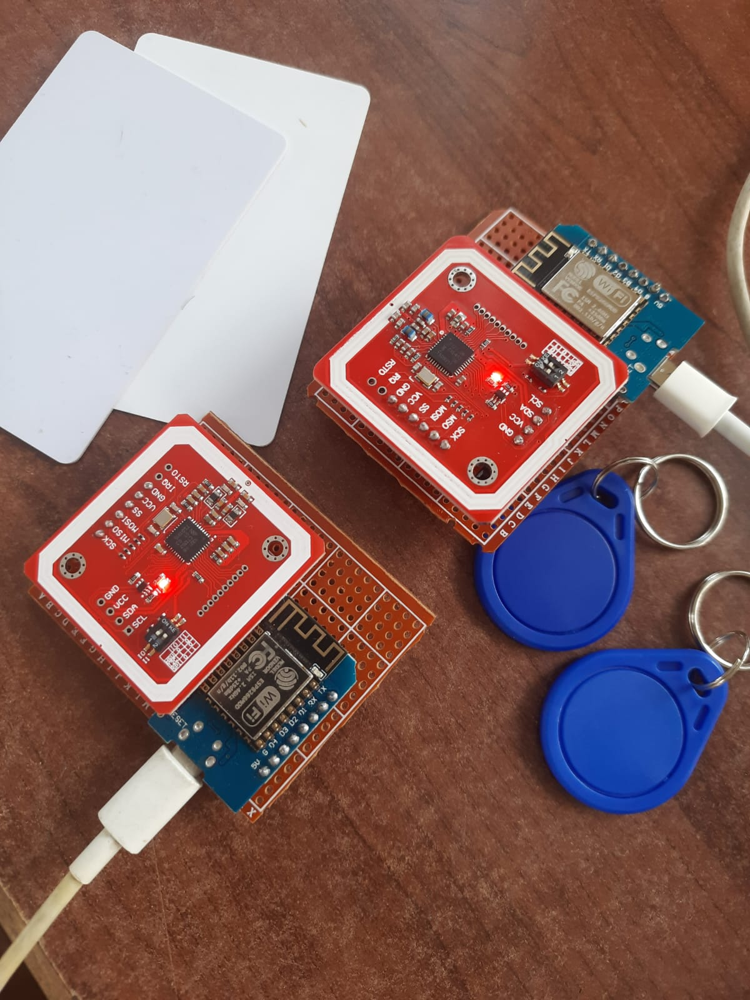

# Self Checkout System in library

The self-checkout system is a user-friendly library management solution that incorporates NFC (Near-field communication) technology, enabling streamlined access, efficient self-checkouts, and enhanced security measures for a modernized experience.

## Table of Contents

- [Self Checkout System in Library](#self-checkout-system-in-library)
  - [Table of Contents](#table-of-contents)
  - [Getting Started](#getting-started)
  - [Prerequisites](#prerequisites)
      - [1. For Frontend \[React\]](#1-for-frontend-react)
        - [Installation](#installation)
        - [Usage](#usage)
        - [Web serial API](#web-serial-api)
      - [2. Backend \[Django\]](#2-backend-django)
        - [Usage](#usage-1)
        - [Database Setup](#database-setup)
      - [3. Hardware Requirequirement](#3-hardware-requirequirement)
  - [Contributing](#contributing)

## Getting Started

Welcome to Self Checkout System in Library for libraries.

## Prerequisites

#### 1. For Frontend [React]

Make sure you have the following tools installed:

- [Node.js](https://nodejs.org/)
- [npm (Node Package Manager)](https://www.npmjs.com/)

##### Installation

1. Clone the repository:

```bash
$ git clone https://github.com/Mandakini-S/Self-checkout-system-in-LIbrary
```

2. Navigate to the project directory:

```bash
$ cd frontend
```

3. Install dependencies:

```bash
$ npm install
```

##### Usage

To view the frontend of the system:

```bash
$ npm start
```
This command will start the development server, and you can access the system in your browser at http://localhost:3000.

##### Web serial API

It provides a way for websites to read from and write to serial devices. These devices may be connected via a serial port, or be USB or Bluetooth devices that emulate a serial port. Learn more : [Web serial API](https://developer.mozilla.org/en-US/docs/Web/API/Web_Serial_API)


#### 2. Backend [Django]


Make sure you have the following tools installed:
- [Python](https://www.python.org/) (preferably Python 3.x)
- [Django](https://www.djangoproject.com/)
- [Django REST Framework](https://www.django-rest-framework.org/)
- [MySQL](https://www.mysql.com/)
- [PySerial](https://pyserial.readthedocs.io/en/latest/index.html) for serial data transfer

##### Usage

To run the Django development server:

  ```bash
  python manage.py runserver
  ```

The development server will start, and you can access the backend API at [http://localhost:8000/](http://localhost:8000/).


##### Database Setup

This project uses MySQL as the database. Make sure you have MySQL installed and running. Adjust the database settings in `backend/settings.py` to connect to your MySQL database.

#### 3. Hardware Requirequirement

- NFC Tag
- RFID Card
- PN532
- Wemos D1 Mini



## Contributing
I welcome contributions to enhance this system! Follow these steps:

1. Fork this project.
2. Create a new branch (git checkout -b feature/your-feature).
3. Commit your changes (git commit -m 'Add some feature').
4. Push to the branch (git push origin feature/your-feature).
5. Open a pull request.

<div style="text-align: center;">Happy Coding!</div>
